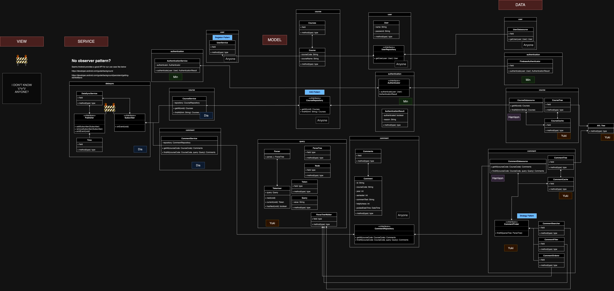
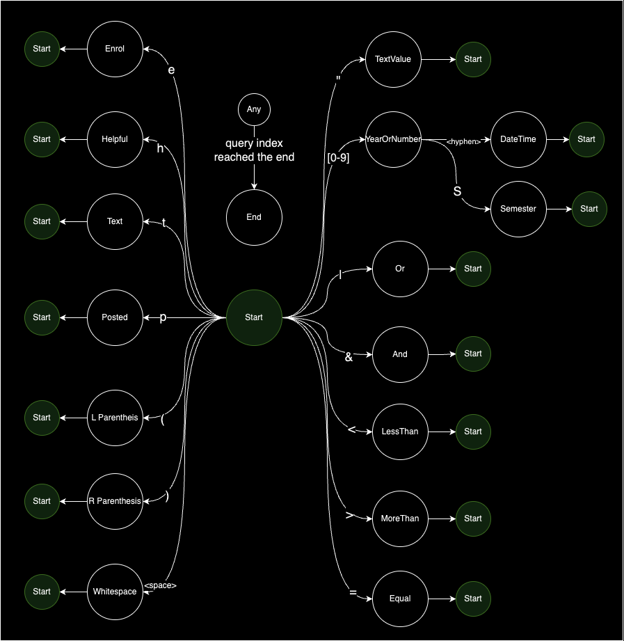

# [G01 - Course++] Report

## Table of Contents
1. [Team Members and Roles](#team-members-and-roles)
2. [Summary of Individual Contributions](#summary-of-individual-contributions)
3. [Application Description](#application-description)
4. [Application UML](#application-uml)
5. [Application Design and Decisions](#application-design-and-decisions)
6. [Summary of Known Errors and Bugs](#summary-of-known-errors-and-bugs)
7. [Testing Summary](#testing-summary)
8. [Implemented Features](#implemented-features)
9. [Team Meetings](#team-meetings)
10. [Conflict Resolution Protocol](#conflict-resolution-protocol)

## Administrative
- Firebase Repository Link: https://console.firebase.google.com/project/courses-and-comments/overview

## Team Members and Roles
The key area(s) of responsibilities for each member

| UID   |  Name  |   Role |
|:------|:------:|-------:|
| u7541840 | Haoren Hu | database design, data generation, action simulation |
| u7565753 | Min Su Park | authentication, posting comment, android activity design |
| u7618313 | Porntipa Poonpolsub | data load, android activity design |
| u7582380 | Yuki Misumi | architecture design, refactoring, search functionality, noisy code-formatting police |


## Summary of Individual Contributions

Specific details of individual contribution of each member to the project.

Each team member is responsible for writing **their own subsection**.

A generic summary will not be acceptable and may result in a significant lose of marks.

*[Summarise the contributions made by each member to the project, e.g. code implementation, code design, UI design, report writing, etc.]*

*[Code Implementation. Which features did you implement? Which classes or methods was each member involved in? Provide an approximate proportion in pecentage of the contribution of each member to the whole code implementation, e.g. 30%.]*

*you should ALSO provide links to the specified classes and/or functions*
Note that the core criteria of contribution is based on `code contribution` (the technical developing of the App).

*Here is an example: (Note that you should remove the entire section (e.g. "others") if it is not applicable)*

0. **UID1, Name1**  I have 30% contribution, as follows: <br>
  - **Code Contribution in the final App**
    - Feature A1, A2, A3 - class Dummy: [Dummy.java](https://gitlab.cecs.anu.edu.au/comp2100/group-project/ga-23s2/-/blob/main/items/media/_examples/Dummy.java)
    - XYZ Design Pattern -  class AnotherClass: [functionOne()](https://gitlab.cecs.anu.edu.au/comp2100/group-project/ga-23s2/-/blob/main/items/media/_examples/Dummy.java#L22-43), [function2()](the-URL)
    - ... (any other contribution in the code, including UI and data files) ... [Student class](../src/path/to/class/Student.java), ..., etc.*, [LanguageTranslator class](../src/path/to/class/LanguageTranslator.java): function1(), function2(), ... <br><br>

  - **Code and App Design** 
    - [What design patterns, data structures, did the involved member propose?]*
    - [UI Design. Specify what design did the involved member propose? What tools were used for the design?]* <br><br>

  - **Others**: (only if significant and significantly different from an "average contribution") 
    - [Report Writing?] [Slides preparation?]*
    - [You are welcome to provide anything that you consider as a contribution to the project or team.] e.g., APK, setups, firebase* <br><br>

1. **u7541840, Haoren Hu**  I have 25% contribution, as follows: <br>
  - **Code Contribution in the final App**
  - **Code and App Design** 
  - **Others**: (only if significant and significantly different from an "average contribution") 

2. **u7565753, Min Su Park**  I have 25% contribution, as follows: <br>
  - **Code Contribution in the final App**
  - **Code and App Design** 
  - **Others**: (only if significant and significantly different from an "average contribution") 

3. **u7618313, Porntipa Poonpolsub**  I have 25% contribution, as follows: <br>
  - **Code Contribution in the final App**
  - **Code and App Design** 
  - **Others**: (only if significant and significantly different from an "average contribution") 

4. **u7582380, Yuki Misumi**  I have 25% contribution, as follows: <br>
  - **Code Contribution in the final App**
    - [data/avl](https://gitlab.cecs.anu.edu.au/u7582380/ga-23s2/-/tree/main/src/app/src/main/java/com/example/couseplusplus/data/avl)
    - [model/query](https://gitlab.cecs.anu.edu.au/u7582380/ga-23s2/-/tree/main/src/app/src/main/java/com/example/couseplusplus/model/query)
    - All the Search related features
    - DAO Design Pattern - <!-- it's down below - shall i still mention all the classes here? -->
    - Strategy Pattern
    - Factory Pattern
    - Singleton Pattern
  - **Code and App Design** 
  - **Others**: (only if significant and significantly different from an "average contribution") 
    - Designed the overall architecture
    - Roughly drafted this report
    - Project setup (e.g. gradle setting, githook setting)
    - Adjusted configuration to make APK file

## Application Description

*[What is your application, what does it do? Include photos or diagrams if necessary]*

Course++ is a course review application specifically targetting both ANU students and lecturers. It allows them to see the reviews of a particular course, which the fellow students posted before. The search/filter functionality enables them to narrow down the reviews in various factors, including the helpfulness, the posted date, the enrolment date and the text. The app gives them the opportunity to learn how each course is really like, which they could not see in Program and Courses or SELT.

### Application Use Cases and or Examples

*[Provide use cases and examples of people using your application. Who are the target users of your application? How do the users use your application?]*

#### Target Users
- *ANU students*
   * *Users can use it to grasp the feel of the course.*
   * *Users can learn how much they should prepare for the course prior the enrolment.*
   * *Users can estimate the amount of work necessary for the course beforehand.*

- *ANU lecturer*
   * *Users can find the brutally honest views of the course that they may not find in SELT as a possible improvement*

#### Use Cases
*List all the use cases in text descriptions or create use case diagrams. Please refer to https://www.visual-paradigm.com/guide/uml-unified-modeling-language/what-is-use-case-diagram/ for use case diagram.*

*Alice is an ANU student considering to take OCMP6442 but not sure what it's like from a student's perspective*
1. *Alice noticed COMP6442 is a mandatory course for her degree*
2. *Alice sees the Program and Courses page, but felt too generic*
3. *Alice opens Course++ and types "COMP6442" in the search bar*
4. *Alice sees a list of comments*
5. *Alice sorted them by the posted date of a comment to see the latest info*
6. *Alice searches the comments that have the helpfulness score of 5 or more to pinpoint the valuable ones*
7. *Alice learnes from one of the comments that it requires to code an Android app and decided to learn it beforehand*
8. *Alice presses the helpfulness icon on the comment*
9. *Alice closes Course++*

*Bob is a COMP6442 lecturer at ANU but not sure what the students really think about the course*
1. *Bob noticed no one asks anything in his class*
2. *Bob sees SELT but does not find many detailed feedback*
3. *Bob opens Course++ and types "COMP6442" in the search bar*
4. *Bob searches the comments that are posted after 2023 in which he started to lecture COMP6442*
5. *Bob finds that a lot of students want to see live coding demo of the concepts he teaches in the lecture, and decided to do it in the next run*
6. *Bob presses the helpfulness icon on the comment*
7. *Bob closes Course++*

**

<hr> 

### Application UML



<hr>

## Code Design and Decisions

This is an important section of your report and should include all technical decisions made. Well-written justifications will increase your marks for both the report as well as for the relevant parts (e.g., data structure). This includes, for example,

- Details about the parser (describe the formal grammar and language used)

- Decisions made (e.g., explain why you chose one or another data structure, why you used a specific data model, etc.)

- Details about the design patterns used (where in the code, justification of the choice, etc)

*Please give clear and concise descriptions for each subsections of this part. It would be better to list all the concrete items for each subsection and give no more than `5` concise, crucial reasons of your design.

<hr>

### Data Structures

*[What data structures did your team utilise? Where and why?]*

Here is a partial (short) example for the subsection `Data Structures`:*

*I used the following data structures in my project:*

1. *LinkedList*
   * *Objective: used for storing xxxx for xxx feature.*
   * *Code Locations: defined in [Class X, methods Z, Y](https://gitlab.cecs.anu.edu.au/comp2100/group-project/ga-23s2/-/blob/main/items/media/_examples/Dummy.java#L22-43) and [class AnotherClass, lines l1-l2](url); processed using [dataStructureHandlerMethod](url) and ...
   * *Reasons:*
      * *It is more efficient than Arraylist for insertion with a time complexity O(1)*
      * *We don't need to access the item by index for xxx feature because...*
      * For the (part), the data ... (characteristics) ...

1. *AVLTree*
   * *Objective: used for storing various keys of comments for [Search], [Search-Filter] feature and caching comments fetched from Firebase Realtime Database (hereafter FirebaseDB).*
   * *Code Locations: defined in [AVLTree](https://gitlab.cecs.anu.edu.au/u7582380/ga-23s2/-/blob/main/src/app/src/main/java/com/example/couseplusplus/data/avl/AVLTree.java) and [Node](https://gitlab.cecs.anu.edu.au/u7582380/ga-23s2/-/blob/main/src/app/src/main/java/com/example/couseplusplus/data/avl/Node.java); processed using [CommentFindingStrategy#find](https://gitlab.cecs.anu.edu.au/u7582380/ga-23s2/-/blob/main/src/app/src/main/java/com/example/couseplusplus/data/comment/CommentFindingStrategy.java#L12) and the implementation classes. 
   * *Reasons:*
      * *It is more efficient than arrays for searching with a time complexity O(log N)*
   * *Other outstandings:*
      * For the comment filter, it supports finding comments in a given range.

<hr>

### Design Patterns
*[What design patterns did your team utilise? Where and why?]*

1. *Singleton Pattern*
   * *Objective: used for ensuring a class object is created only once.*
   * *Code Locations: defined in [CommentDatasource](https://gitlab.cecs.anu.edu.au/u7582380/ga-23s2/-/blob/main/src/app/src/main/java/com/example/couseplusplus/data/comment/CommentDatasource.java) and all the other classes implementing a repository interface at `data` package.
   * *Reasons:*
      * to prevent from data fetching by multiple instances which may result in unwanted behaviours, including reading an incorrect state of the cache.

2. *Factory Pattern*
   * *Objective: used for providing a state object creation capability out of the box.*
   * *Code Locations: defined in [StateFactory](https://gitlab.cecs.anu.edu.au/u7582380/ga-23s2/-/blob/main/src/app/src/main/java/com/example/couseplusplus/model/query/tokenizer/state/StateFactory.java); processed using [StateMachine#getNextState](https://gitlab.cecs.anu.edu.au/u7582380/ga-23s2/-/blob/main/src/app/src/main/java/com/example/couseplusplus/model/query/tokenizer/StateMachine.java#L80) and [StateMachine#findStateToTransition](https://gitlab.cecs.anu.edu.au/u7582380/ga-23s2/-/blob/main/src/app/src/main/java/com/example/couseplusplus/model/query/tokenizer/StateMachine.java#L89)
   * *Reasons:*
      * It encapsulates nitty gritty details of [State](https://gitlab.cecs.anu.edu.au/u7582380/ga-23s2/-/blob/main/src/app/src/main/java/com/example/couseplusplus/model/query/tokenizer/state/State.java) class, so that the responsibility of other classes no longer is polluted by them.

3. *DAO Pattern*
   * *Objective: used for segregating a concern of data layer out of domain and service layer.*
   * *Code Locations: defined in [CommentRepository](https://gitlab.cecs.anu.edu.au/u7582380/ga-23s2/-/blob/main/src/app/src/main/java/com/example/couseplusplus/model/comment/CommentRepository.java) and [CommentDatasource](https://gitlab.cecs.anu.edu.au/u7582380/ga-23s2/-/blob/main/src/app/src/main/java/com/example/couseplusplus/data/comment/CommentDatasource.java); processed using [CommentService](https://gitlab.cecs.anu.edu.au/u7582380/ga-23s2/-/blob/main/src/app/src/main/java/com/example/couseplusplus/service/comment/CommentService.java). In addition, all the other repository interfaces defined at `domain` layer and the corresponding implementations and service classes.*
   * *Reasons:*
      * It encapsulates nitty gritty details of [State](https://gitlab.cecs.anu.edu.au/u7582380/ga-23s2/-/blob/main/src/app/src/main/java/com/example/couseplusplus/model/query/tokenizer/state/State.java) class, so that the responsibility of other classes no longer is polluted by them.

4. *Strategy Pattern*
   * *Objective: used for addomg extensibility of the branching at the comment finder.* 
   * *Code Locations: defined in [CommentFindingStrategy](https://gitlab.cecs.anu.edu.au/u7582380/ga-23s2/-/blob/main/src/app/src/main/java/com/example/couseplusplus/data/comment/CommentFindingStrategy.java) and the implementations; processed using [CommentFinder#processComparison](https://gitlab.cecs.anu.edu.au/u7582380/ga-23s2/-/blob/main/src/app/src/main/java/com/example/couseplusplus/data/comment/CommentFinder.java#L36).*
   * *Reasons:*
      * It encapsulates nitty gritty details of each comment finding logic per token type.
      * It gives us a modularity to add/remove/update any of the logics without touching anything on CommentFinder. This minimises the area of change and the associated risk to a bug.

5. *Strategy Pattern (leaning towards Inversion of Control)*
   * *Objective: used for injecting class dependencies from outside.*
   * *Code Locations: defined in [IoCContainer](https://gitlab.cecs.anu.edu.au/u7582380/ga-23s2/-/blob/main/src/app/src/main/java/com/example/couseplusplus/IoCContainer.java); processed using each Activity classes defined at `view` package.*
   * *Reasons:*
      * It encapsulates how to instantiate a dependency object.
      * It allows us to modify a behaviour of our app by only changing the object to inject.

<hr>

### Parser

### <u>Grammar(s)</u>
*[How do you design the grammar? What are the advantages of your designs?]*
*If there are several grammars, list them all under this section and what they relate to.*

Production Rules:
```
<query> ::= <expression> | <expression> <condition> <query>
<expression> ::= helpful <operator> <number> | enrol <operator> <enroldate> | posted <operator> <date> | text <fuzzy> <string> | ( <query> )
<condition> ::= & | \|
<operator> ::= < | > | = | <= | >=
<fuzzy> ::= ~
<number> ::= <digit\0> <numbercont> | <digit>
<numbercont> ::= <digit> <numbercont> | <digit>
<digit\0> ::= [1-9]
<digit> ::= [0-9]
<string> ::= "<characters>"
<characters> ::= <character> <characters> | <character>
<character> ::= <a set of all characters - ">
<date> ::= <digit><digit><digit><digit>-<digit><digit>-<digit><digit>
<enroldate> ::= <digit><digit><digit><digit><semester>
<semester> ::= S1 | S2
```

### <u>Tokenizers and Parsers</u>

*[Where do you use tokenisers and parsers? How are they built? What are the advantages of the designs?]*
- [Tokenizer]() and [Parser]() are used at [QueryParseTreeCreator#create]() to parse [Query]() to find the matching [Comment]()s later.
- Tokenizer is built using [StateMachine]() based on the state diagram below. The main advantage is its modularity - we can add/remove/update any states by only changing the very state class without polluting the actual tokenizer class.

- We also added the graceful variants [GracefulTokenizer](), [GracefulParser]() to allow the user type an incomplete query to still search the matching comments at its best effort.

<hr>

### Others

*[What other design decisions have you made which you feel are relevant? Feel free to separate these into their own subheadings.]*

<br>
<hr>

## Implemented Features
*[What features have you implemented? where, how, and why?]* <br>
*List all features you have completed in their separate categories with their featureId. THe features must be one of the basic/custom features, or an approved feature from Voice Four Feature.*

### Basic Features
<!-- TODO ask what to type on the right of feature id -->
1. [LogIn]. Users must be able to log in (not necessarily sign up). (easy)
   * Code: 
     * [Login]()
     * [Register]()
     * [UserService#login, UserService#logout, UserService#register](https://gitlab.cecs.anu.edu.au/u7582380/ga-23s2/-/blob/main/src/app/src/main/java/com/example/couseplusplus/service/user/UserService.java) 
     * [UserDatasource](https://gitlab.cecs.anu.edu.au/u7582380/ga-23s2/-/blob/main/src/app/src/main/java/com/example/couseplusplus/data/user/UserDatasource.java)
   * Description of feature: It allows a user to login, logout and register the account using Firebase Authentication. <br>
   * Description of your implementation: Each Activity uses UserService to login, logout, register and check if the authentication token cache is available locally. We intentionally encapsulated Firebase concerns out of both view and service layer by packing it at data layer through [UserRepository]() interface. This approach allows us to switch to the other authentication service provider without (hopefully) changing all the layers but data layer. <br>
   * Link to the Firebase Authentication dashboard: https://console.firebase.google.com/project/courses-and-comments/authentication/users

2. [DataFiles]. Create data file(s) with at least 2,500 valid data instances, which are then used to feed your app to simulate different users’ interactions on with the App. A data item can be an action (e.g., a new product added to the server, a user requested to view a profile; etc.). (easy)
   * Link to the Firebase Realtime Database dashboard: https://console.firebase.google.com/project/courses-and-comments/database/courses-and-comments-default-rtdb/data
   * Data generation script: [link]()
   * Implementation: We sourced the ANU course data from [Programs and Courses](https://programsandcourses.anu.edu.au/) page. Regarding the comments, we generated using the above script by choosing a set of words from the pre-defined data set. We used Firebase Realtime Database to store all the data in JSON format. We intentionally placed a course code as a key to each `comment` child object to speed up the fetching by Course++, because our design narrows down the comments of which the user wants to see the course.

3. [LoadShowData]. When a user is logged in, load data (from the file(s) and/or Firebase) at regular time intervals, and visualise the same in the App. (e.g., If the main page contains a list of featured products, the user may see an increased number of products; as well as receive notifications from interactions simulated from the data stream). (medium)
   * Code:
     - [MainActivity]()
     - [CommentsActivity]()
     - [CourseService]()
     - [CourseDatasource]()
     - [CommentService]()
     - [CommentDatasource]()
     - [CourseCache]()
     - [CommentCache]()
   * Feature description: The app loads all the courses at ANU from FirebaseDB. Once a user specified a course, it loads all the comments from FirebaseDB.
   * Implementation description: Firebase provides the API (i.e. ...) that allows to listen for the data changes. We used it to update the course and comments real time. In addition, we cached the data in CourseCache and CommentCache to prevent from paying the cost of travelling the Internet.

4. [Search]. Users must be able to search for information on your app. (medium)
   * Code:
     - [MainActivity]()
     - [CommentsActivity]()
     - [Tokenizer]()
     - [Parser]()
     - [Query]()
     - [ParseTree]()
     - [ParseTreeWalker]()
     - [CommentFinder]()
     - [CourseFinder]()
     - [QueryParseTreeCreator]()
     - [CommentService#findAll]()
     - [CourseDatasource]()
     - [CommentDatasource#findAll]()
     - [CourseDatasource]()
     - [CourseCache]()
     - [CommentCache]()
     - [AVLTree]()
   * Feature description: The app searches courses by a arbitrary string and comments by the query the app supports. Couses can be searched by its code or name. Comments can be searched by its helpfulness, posted date, enrolment date of the student, text.
   * Implementation description: The courses are searched by iterating the course list from CourseCache and see if the string is contained in the course code or name. The comments are serached by parsing the query as parse tree and then traversing it and evaluating each operation on the fly against the AVL trees in CommentCache. Each tree is defined a key from each Comment perspective that can be used to search to fasten the speed.

   <br>

### Custom Features
Feature Category: Search-related features <br>
1. [Search-Invalid]. Description of the feature  (easy)
   * Code: 
     - [GracefulTokenizer]()
     - [GracefulParser]()
     - [TokenType.Error]()
     - [ErrorNode]()
     - [CommentFinder]()
     - [QueryParseTreeCreator]()
     - [IoCContainer]()
   * Feature description: A user can search comments by a partially incorrect query. The app tries to get the correct portion and use it to search them. If entirely incorrect, no search result is shown.
   * Description of your implementation: Both GracefulTokenizer and GracefulParser extends the corresponding normal class (i.e. Tokenizer and Parser respectively). If an illegal token was found or token state machine cannot transition to a state correctly, Tokenizer throws and exception. GracefulTokenizer will catch it and instead return a Token object with its type being Error. If Parser#parse, Parser#query or Parser#expression found an illegal syntax, Parser throws an exception. GracefulParser will catch it and instead return ErrorNode, which will be used by CommentFinder later to return an empty list as a result.
     <br>

2. [Search-Filter]. Sort and filter a list of items returned from searches, with the use of suitable UI components. (easy)
   * Code: 
     - [CommentFinder]()
     - [AVLTree]()
   * Feature description: Course++ search query supports finding the comments by specifying a range of a factor. For example, a user can search comments that are posted from 2022 to 2023 by e.g. "posted >= 2022-01-01 & posted <= 2023-12-31". It also allows to sort the comments by helpfulness, enrolment date and posted date by choosing it via a radio button and specifying the sorting order via "Sort" button.
   * Description of your implementation: We accomplished the range search by traversing the AVL tree such that (no energy to write this now. later...). The sorting is implemented by using Stream#sorted against the comment list.
   <br><br>

Feature Category: Firebase Integration <br>
3. [FB-Auth] Description of the feature (easy)
   * Code: 
     - [UserDatasource]()
     - [UserRepository]()
   * [Class B](../src/path/to/class/file.java#L30-85): methods A, B, C, lines of code: 30 to 85
   * Description of your implementation: (FireBase API stuff here.) We gathered all the Firebase logic inside UserDatasource that implements UserRepository interface to detach the concern from our domain layer.<br>

4. [FB-Persist].
   * Code:
     - [CourseDatasource]()
     - [CommentDatasource]()
   * Implementation description: (Firebase API stuff), (how we manage the listeners to reduce its load after the Activity finishes)

<hr>

### Surprised Features

- If implemented, explain how your solution addresses the task (any detail requirements will be released with the surprised feature specifications).
- State that "Suprised feature is not implemented" otherwise.

Suprised feature is not implemented

<br> <hr>

## Summary of Known Errors and Bugs

*[Where are the known errors and bugs? What consequences might they lead to?]*
*List all the known errors and bugs here. If we find bugs/errors that your team does not know of, it shows that your testing is not thorough.*

*Here is an example:*

1. *Bug 1:*
   - *A space bar (' ') in the sign in email will crash the application.*
   - ...

2. *Bug 2:*
3. ...

<br> <hr>


## Testing Summary

*[What features have you tested? What is your testing coverage?]*
*Please provide some screenshots of your testing summary, showing the achieved testing coverage. Feel free to provide further details on your tests.*
<!-- TODO ask if attaching a testing report suffices -->

*Here is an example:*

1. Tests for Search
   - Code: [TokenizerTest Class, entire file](https://gitlab.cecs.anu.edu.au/comp2100/group-project/ga-23s2/-/blob/main/items/media/_examples/Dummy.java) for the [Tokenizer Class, entire file](https://gitlab.cecs.anu.edu.au/comp2100/group-project/ga-23s2/-/blob/main/items/media/_examples/Dummy.java#L22-43)
   - *Number of test cases: ...*
   - *Code coverage: ...*
   - *Types of tests created and descriptions: ...*

2. Tests for AVL Tree
   - Code: [AVLTreeTest](https://gitlab.cecs.anu.edu.au/u7582380/ga-23s2/-/blob/main/src/app/src/test/java/com/example/couseplusplus/data/avl/AVLTreeTest.java) for [AVLTree]()
   - *Number of test cases: ...*
   - *Code coverage: ...*
   - *Types of tests created and descriptions: ...*

(It's all in test package!)

...

...

<br> <hr>


## Team Management

### Meetings Records
* Link to the minutes of your meetings like above. There must be at least 4 team meetings.
  (each commited within 2 days aftre the meeting)
* Your meetings should also have a reasonable date spanning across Week 6 to 11.*


- *[Team Meeting 1](meeting1.md)*
- *[Team Meeting 2](meeting2.md)*
- *[Team Meeting 3](meeting3.md)*
- *[Team Meeting 4](meeting4.md)*
- *[Team Meeting 5](meeting5.md)*
- ... (Add any descriptions if needed) ...

<hr>

### Conflict Resolution Protocol
*[Write a well defined protocol your team can use to handle conflicts. That is, if your group has problems, what is the procedure for reaching consensus or solving a problem?
(If you choose to make this an external document, link to it here)]*

This shall include an agreed procedure for situations including (but not limited to):
- e.g., if a member fails to meet the initial plan and/or deadlines
- e.g., if your group has issues, how will your group reach consensus or solve the problem?
- e.g., if a member gets sick, what is the solution? Alternatively, what is your plan to mitigate the impact of unforeseen incidents for this 6-to-8-week project? 

- see our [confliect-resolution-protocol.md](confliect-resolution-protocol.md)
